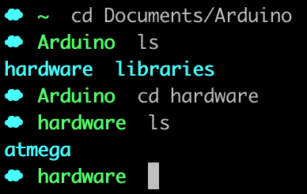
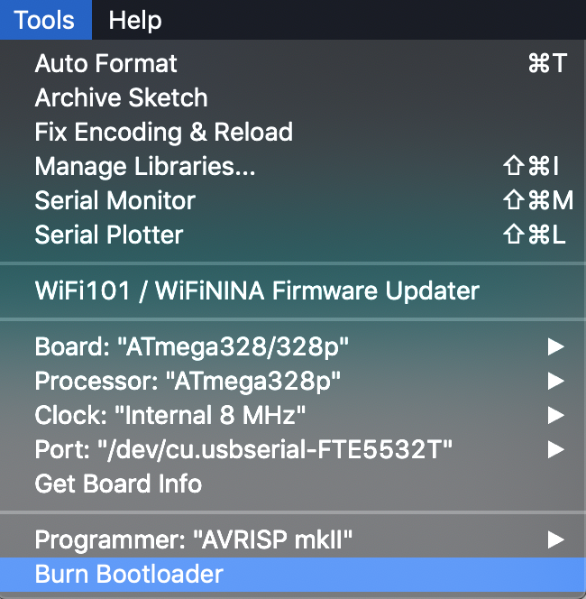
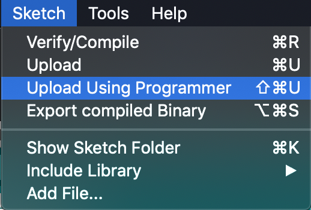
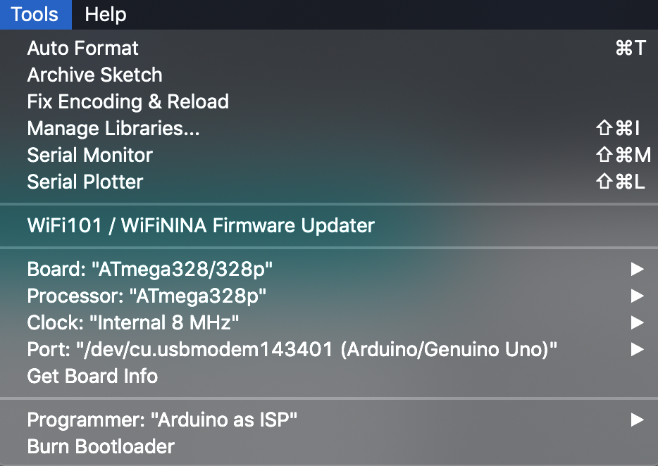

# Micro Word Clock v2

## Arduino IDE setup (must do for programming with AVRISP and Arduino)
- Download the latest version of the [Arduino IDE](https://www.arduino.cc/en/main/software)
- `cd ~/Documents/Arduino && mkdir hardware`
- cd into `hardware` clone [this repository](https://github.com/carlosefr/atmega) into it

- Restart the Arduino IDE, you should see `Tools > Board > ATMega328` and some other things show up

## Upload instructions with AVRISP MKII programmer

##### Burning the bootloader
- Plug in the AVRISP, select `Tools > Programmer > AVRISP mkII`
- Plug in ICSP header from AVRISP to ICSP header on Gizmo (ICSP labels on Gizmo are on back of board)
- Select `Tools > Board > ATmega328/328p`
- Select `Tools > Processor > ATmega328p`
- Select `Tools > Clock > Internal 8 MHz`
- Select `Tools > Burn Bootloader`

##### Uploading sketch
- Open `MicroWordClock2-Arduino.ino` in Arduino IDE
- Select `Sketch > Upload Using Programmer`

## Upload instructions with Arduino Uno

##### Setting up the Arduino Uno as an ISP
- Plug in the Arduino, select `Tools > Programmer > Arduino as ISP` and `Tools > Board > Arduino/Genuino Uno`
- Select `File > Examples > ArduinoISP` and see a new script open
- Make sure that the correct port is selected in `Tools > Port`

- On the top left corner of the window, select upload

##### Burning the Bootloader
- Wire up the Arduino to Gizmo's ICSP header, but make sure to wire up power last (Gizmo has the standard ICSP header configuration). Use the following wiring:

| Arduino pin | ICSP header pin |
|-------------|-----------------|
| 10          | RESET           |
| 11          | MOSI            |
| 12          | MISO            |
| 13          | SCK             |
| 5 V         | VCC             |
| GND         | GND             |

- Connect a 10uF capacitor between Arduino's RESET pin and GND
- Select `Tools > Board > ATmega328/328p`
- Select `Tools > Processor > ATmega328p`
- Select `Tools > Clock > Internal 8 MHz`
- Select `Tools > Burn Bootloader`

##### Uploading sketch
- Open `MicroWordClock2-Arduino.ino` in Arduino IDE
- With cap still plugged in and same `Tools` settings as before, select `Sketch > Upload Using Programmer`
- The TX and RX LEDs on the Arduino should start blinking, all LEDs on the Gizmo board should light up initially, then the board should be good to go

##### Troubleshooting 
- Make sure the correct option is selected under `Tools > Board` - should be Arduino Uno only when uploading ISP sketch
- Make sure the connections to the 10uF cap are good - I plugged it into a breadboard and used jumper wires to connect
- If nothing's working, try power cycling

## Setting the time 
- Once the sketch is uploaded, unplug the Arduino/programmer and plug in Gizmo's independent power supply
- Hold down SW1 until words start blinking. To cycle through "quarter past", "half past", etc., press SW1 the number of minutes you want to increment past the time designator
- To set the hour, hold down SW1 again until the current hour starts blinking and cycle through. Once you're done, hold down SW1 until only one LED blinks again